<!-- i want to make readme for my project -->

# Blog App

This is a simple blog app that allows users to create, read, update and delete blog posts. It is built with Django and React js.

## Features

- User authentication
- Create, read, update and change status blog posts
- Comment on blog posts
- Like and unlike blog posts
- Update user profile

## Technologies

- Django
- React js

## Dependencies

- Redis
- MinIo
- Memcached

## Installation

1. Clone the repository
2. Install dependencies
   for server can be installed by running the following command
   `pip install -r requirements.txt`
   for client can be installed by running the following command
   `yarn`
3. Run migrations
   `python manage.py migrate`
4. Run the server
   `python manage.py runserver`
5. Run the client
   `yarn start`

## Usage

1. Run redis server, minio and memcached server
   [Minio](https://docs.min.io/docs/minio-quickstart-guide.html)
   [Redis](https://redis.io/download)
   [Memcached](https://memcached.org/)
   
2. Create a superuser
   `python manage.py createsuperuser`
3. Login to the admin dashboard and create a user
4. Login to the user account and create a blog post
5. View the blog post

## Screenshots

- Sign in
  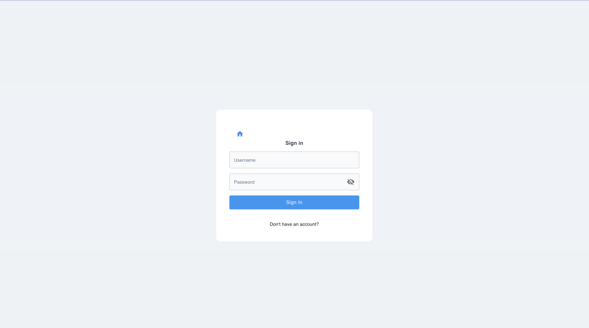
- Sign up
  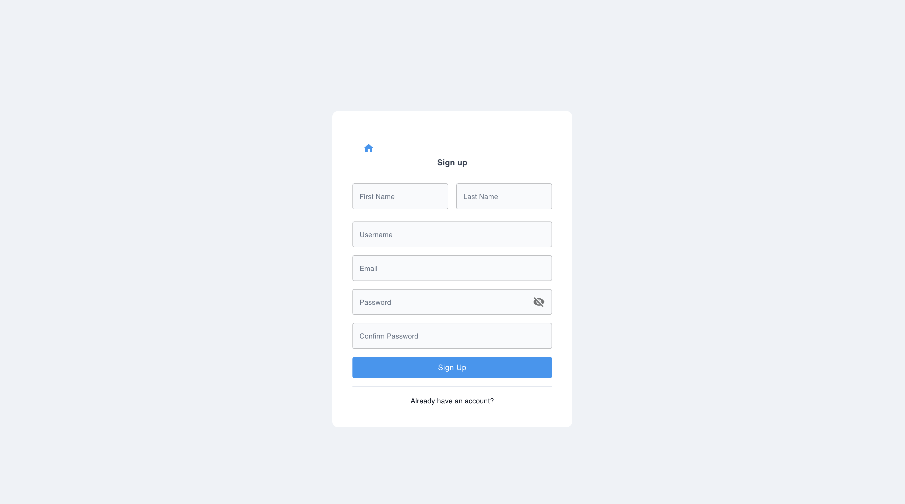
- Home
  
- Detail Post
  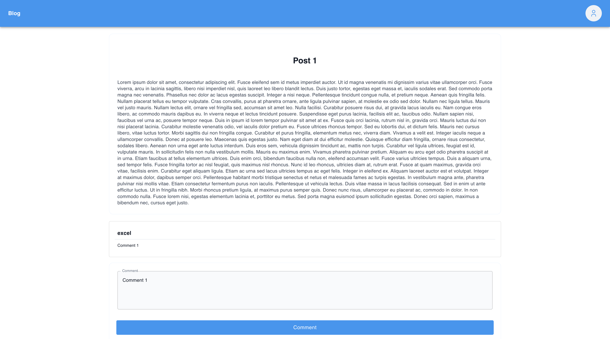
- List Users
  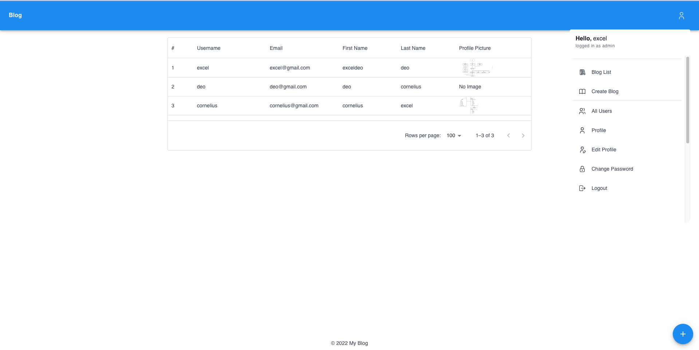
- Profile
  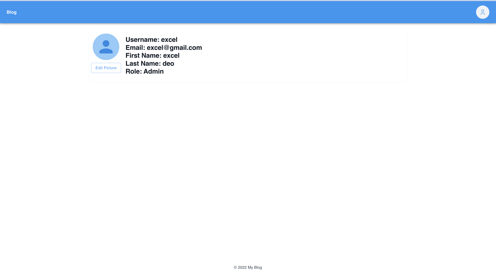
- Upload Profile Picture
  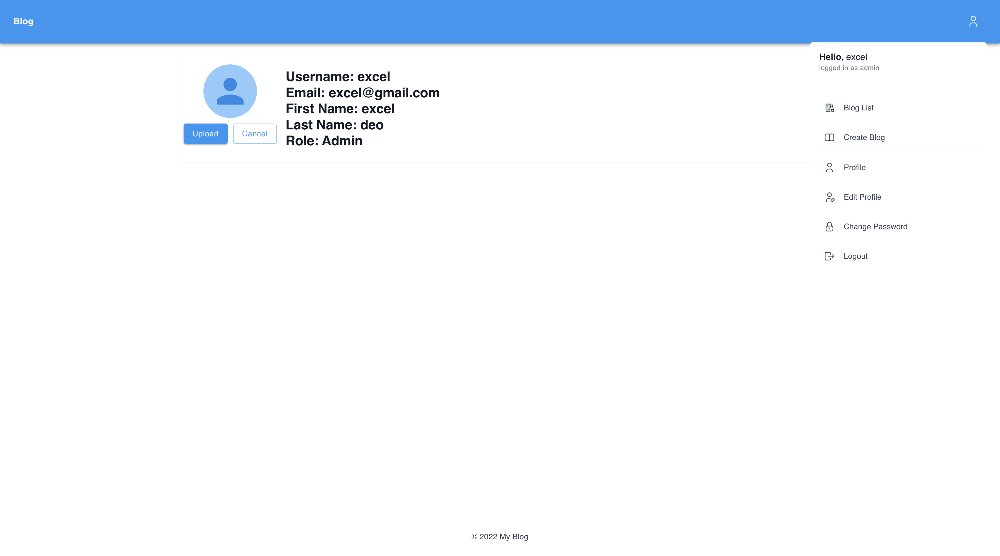
- Edit Profile
  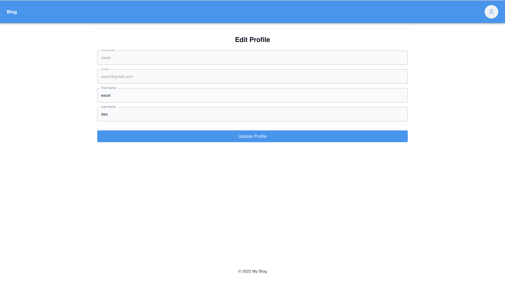
- Change Password
  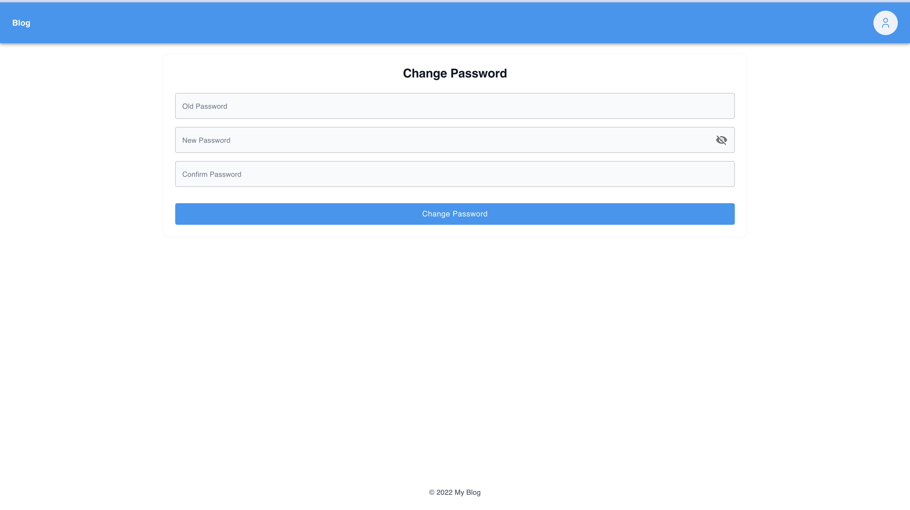
- Create Post
  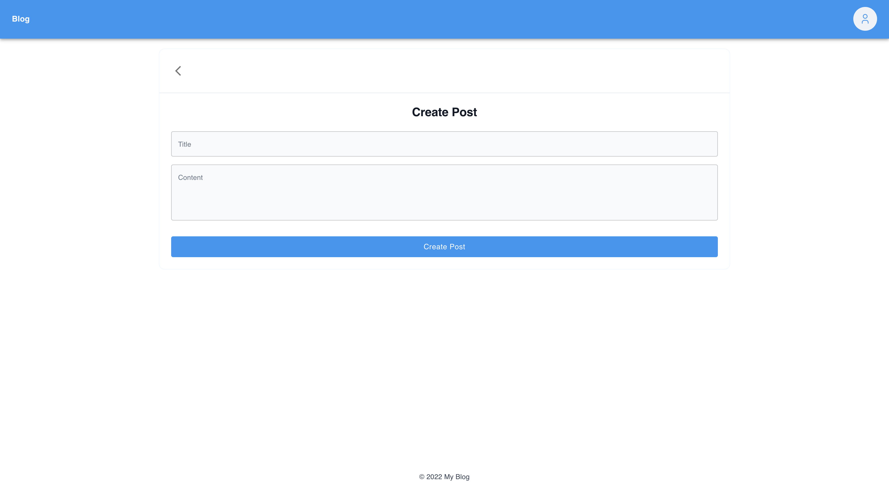
- Update Post
  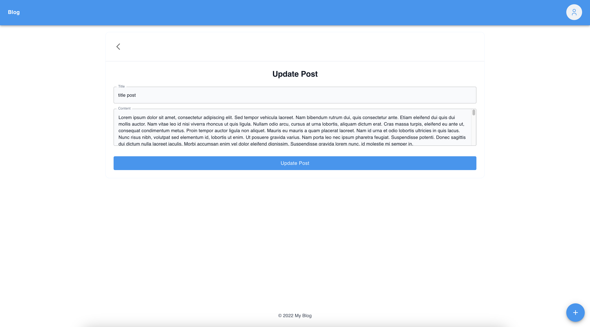
- List Post
  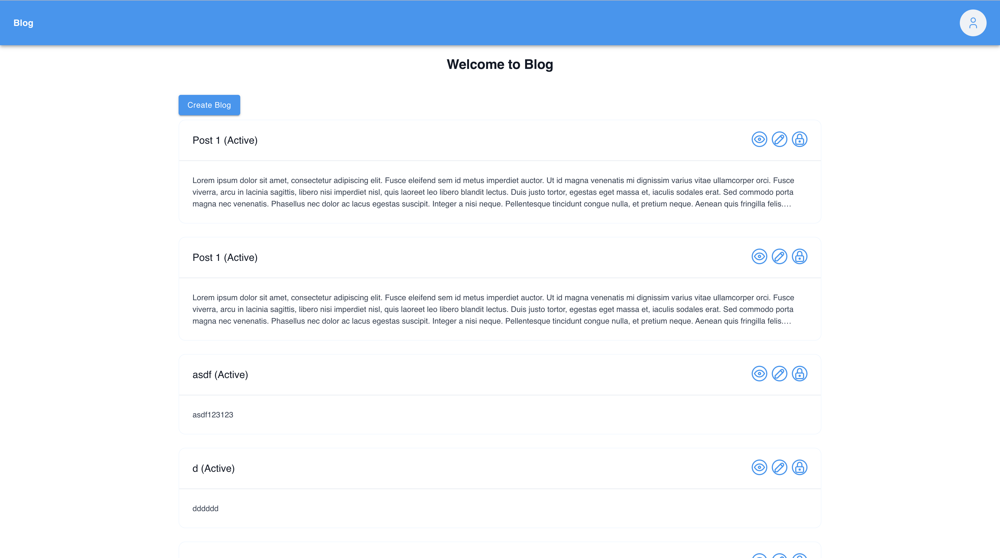
- List Post Search
  

## ERD

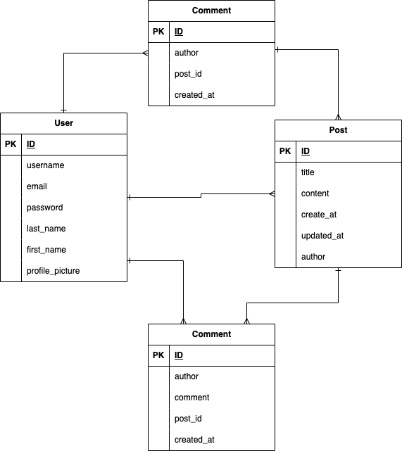

## Flowchart

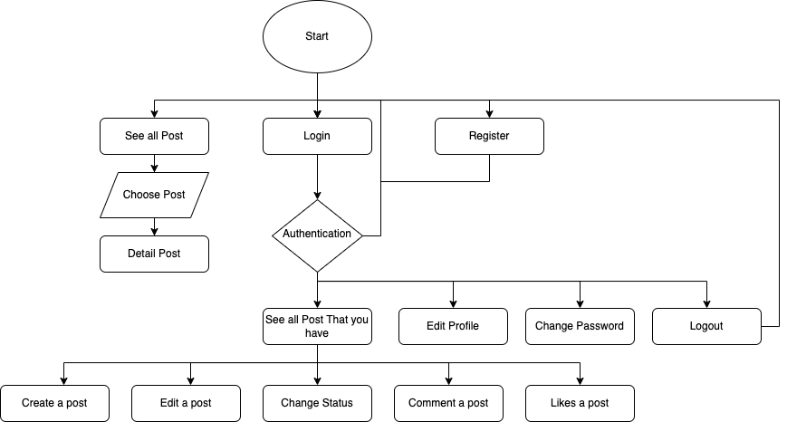

## API Endpoints

https://documenter.getpostman.com/view/11566293/2sA35G2MX6
