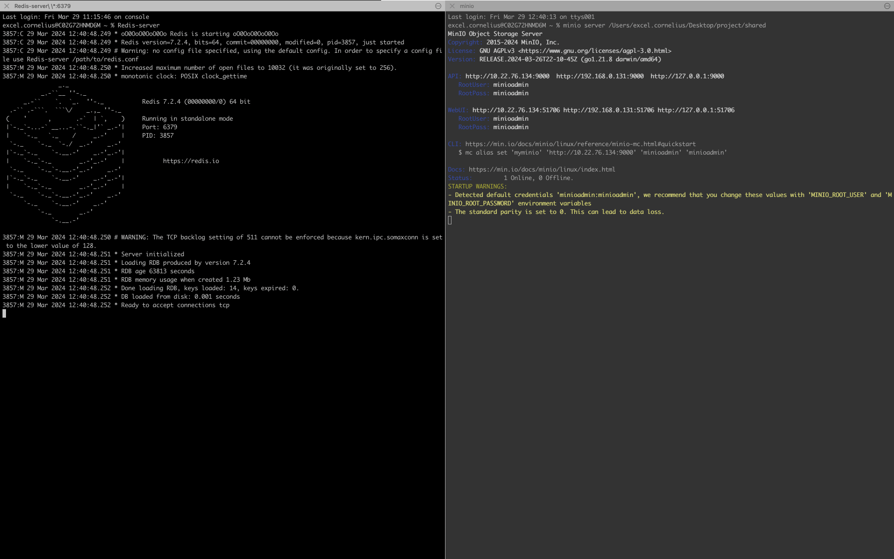
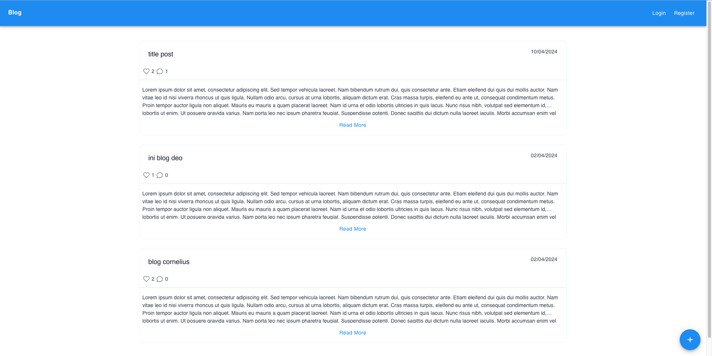
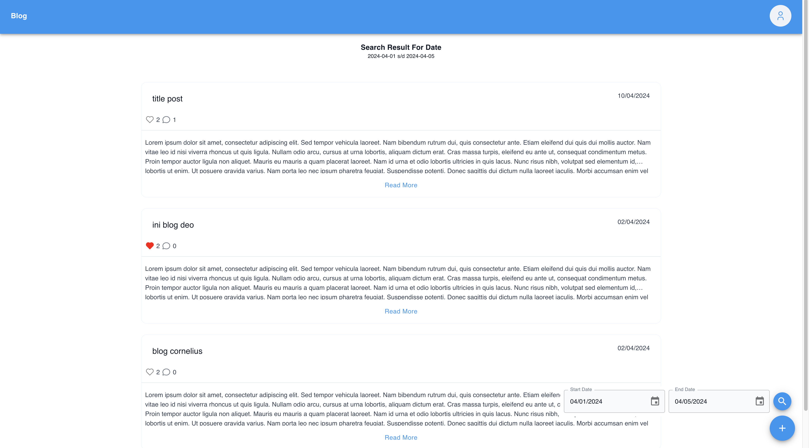
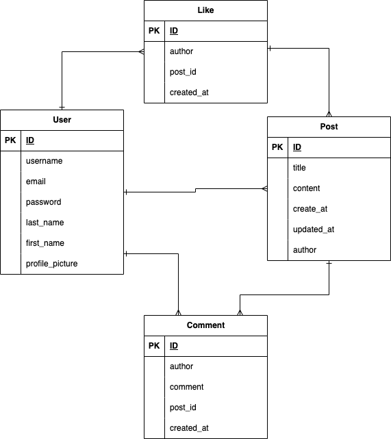

<!-- i want to make readme for my project -->

# Blog App

This is a simple blog app that allows users to create, read, update and delete blog posts. It is built with Django and React js.

## Features

- User authentication
- Create, read, update and change status blog posts
- Comment on blog posts
- Like and unlike blog posts
- Update user profile

## Technologies

- Django
- React js

## Dependencies

- Redis
- MinIo
- Memcached

## Installation

1. Clone the repository
2. Install dependencies
   for server can be installed by running the following command
   `pip install -r requirements.txt`
   for client can be installed by running the following command
   `yarn`
3. Run migrations
   `python manage.py migrate`
4. Run the server
   `python manage.py runserver`
5. Run the client
   `yarn start`

## Usage

1. Run redis server, minio and memcached server
   [Minio](https://docs.min.io/docs/minio-quickstart-guide.html)
   [Redis](https://redis.io/download)
   [Memcached](https://memcached.org/)
   
2. Create a superuser
   `python manage.py createsuperuser`
3. Login to the admin dashboard and create a user
4. Login to the user account and create a blog post
5. View the blog post

## Screenshots

- Sign in
  
- Sign up
  
- Home
  
- Detail Post
  
- List Users
  
- Profile
  
- Upload Profile Picture
  
- Edit Profile
  
- Change Password
  
- Create Post
  
- Update Post
  
- List Post
  
- List Post Search
  

## ERD



## Flowchart


## API Endpoints

https://documenter.getpostman.com/view/11566293/2sA35G2MX6

# MYPROJECT

my project is a test new app for learning how to django ORM works.
if you want to add new create seeder in migration can be run by running the following command
`python manage.py makemigrations new_app -n create_data`
and add the following code in the migration file

```python
from django.db import migrations

def create_data(apps, schema_editor):
    TestModel = apps.get_model('new_app', 'TestModel')
    TestModel.objects.create(tag='tag1', text_field1='text'*5, text_field2='text'*5)

class Migration(migrations.Migration):

    dependencies = [
        ('new_app', '0001_initial'),
    ]

    operations = [
        migrations.RunPython(create_data),
    ]
```

after that run the following command
`python manage.py migrate`

# Run cron job

i have python script that function to count active user, you can run the script by running the following command
`python manage.py count_active_user`

1. Open the crontab editor by typing crontab -e in your terminal.

2. In the editor, you can add a new cron job by adding a new line. A cron job line has the following structure:

`* * * * * command-to-be-executed`

- The five asterisks can be replaced with specific time units to schedule the job. From left to right, they represent: minute (0 - 59), hour (0 - 23), day of the month (1 - 31), month (1 - 12), and day of the week (0 - 7, where both 0 and 7 are Sunday).
  To run your standalone.py script every day at midnight, for example, you can add the following line:

3. Replace /usr/bin/python3 with the path to your Python interpreter, and /path/to/your/cron_count_active_users.py with the path to your standalone.py script.

4. Save and close the editor to install the new cron job.
